# Hangman, Capitals of Europe - Game

# Introduction
This project is based on the game HangMan, this game has been around since 1894 under the name "Birds, Beasts and Fishes".

 The main goal of the game is to guess the full word before hangman is hung. This is done by guessing a letter in the word.

If the guess is right, it is placed in the blank spaces that make up the word. If it is not, the user loses a life. The word must be guessed before the user runs out of lives.

[Live Project Here](https://hangman-project3.herokuapp.com/)

## Goal

My goal is to utilise my knowledge of python to create a game which gathers user inputs and provides responses based on the input given.

## Table Content

* [**Introduction**](<#introduction>)
* [**User Experience UX**](<#user-experience-ux>)
* [**Design**](<#design>)
    * [Colours](<#colours>)
    * [Flowcharts](<#flowcharts>)
* [**Game Features**](<#game-features>)
* [**Storage Data**](<#storage-data>)
* [**Testing**](<#testing>)
* [**Issues and Bugs**](<#issues-and-bugs>)
* [**Deployment**](<#deployment>)
* [**Credits**](<#credits>)
* [**Content**](<#content>)
* [**Technologies Used**](<#technologies-used>)

# User Experience UX

* As a user, I want to:

1. Be able to understand the purpose of the App and start a new game.
2. Be able to follow the score, see the wrong and right letters appear once I take a turn, and see how many tries remain before the game is over.
3. Be able to watch my results and other players' results on the Scoreboard.
4. Be able to play the game again with a different word as chosen by the computer.
5. Be challenged and try to improve on my previous scores. 
6. Compare my scores with other users on the Scoreboard.

[Back to top](<#table-content>)

## Design

#### Colours
* The colours in the game are supplied by the Python Colorama Model

### Flowcharts
I designed this project on the basis of the below flowchart.I created flowcharts to assist me with the logical flow throughout the application. The charts were generated using [Lucidchart](https://lucid.app/) 

[Back to top](<#table-content>)

## Game Features

### Logo and Intro Message

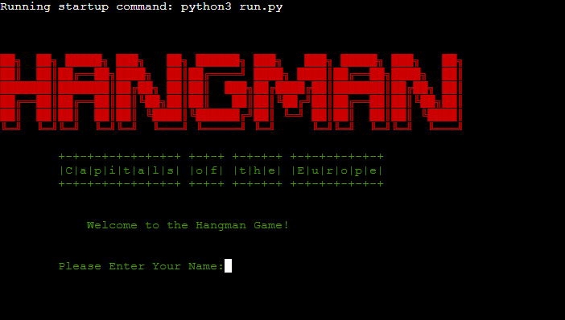

* When the users reach the website, they will see this feature. The game logo and the intro message are displayed here. 

### Game Rules
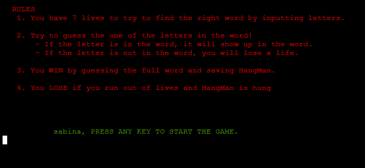
* After the user inputs their name, the program will display the game rules. The player then presses any key to start the game. 

### Hangman Stage 1
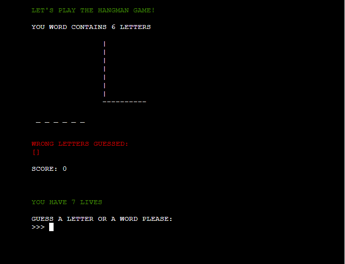  

This feature displays where the main scene happens. Here the user can play and see the following information about the game:
* Numbers of letters chosen by the computer 
* Hangman stages
* Letters guessed right
* Letters guessed wrong
* Current score
* Current number of lives
* Input to guess a letter or a full word

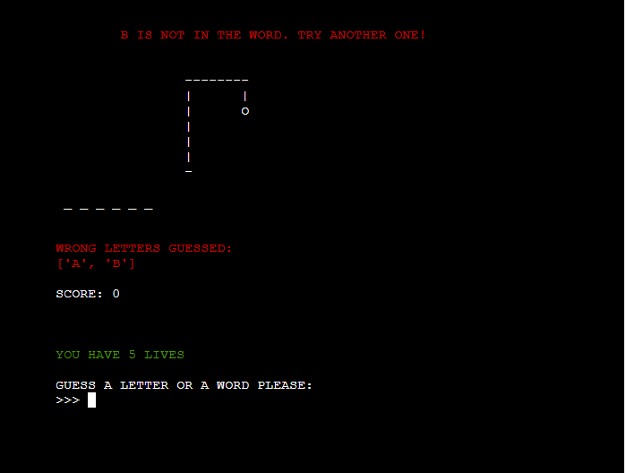  
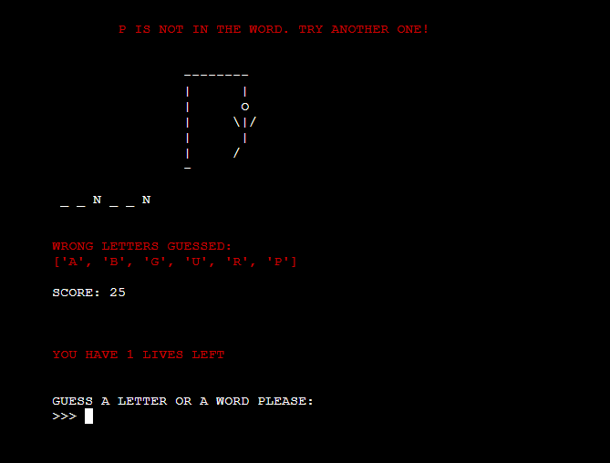  
Any time the player guesses a wrong letter, a part of the hangman appears

### Hangman Lose

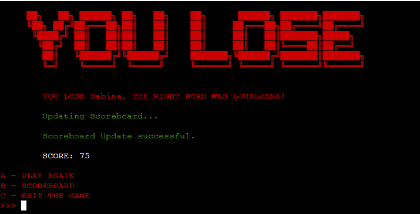
* 7 letters guessed wrong the player will see the full hangman and the game is over.

### Hangman Win

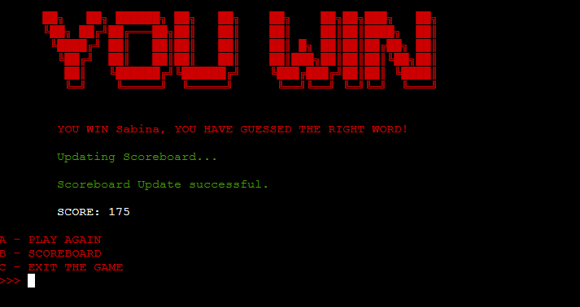
* If the player guessed the full word letter by letter, they will see this feature and will win the game.

### Hangman Win Full Word

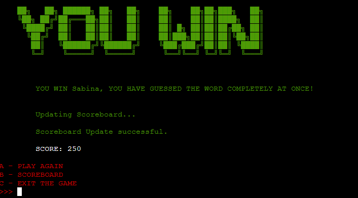
* If the player guessed all the letters that appear in the word thereby completing the word or at least guessing no more than 3 correct letters before completing the full word, this feature will appear.

### Menu Options

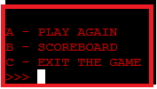
* In the end of the game users will have access to the menu where they can choose from these options:  
[A] - Play Again  
[B] - Scoreboard  
[C] - Exit Game

### Scoreboard
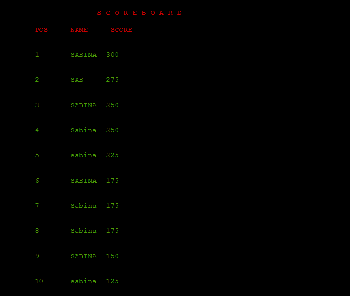
* The Scoreboard shows the 10 players with the best scores. The scores of the players are stored in excel sheet connected to the Google Sheets. 
* The connections are explained here [**Storage Data**](<#storage-data>)

### Exit Game

* The players will see this message if they will chose to exit the game by typing [C].

[Back to top](<#table-content>)

## Storage Data

* I have used a Google sheet to save the player name and score.  This sheet is connected to the code through the Google Drive and Google Sheet API by the Google Cloud Platform. This method allows me to send and receive data as I had access to the Google Sheet API credentials. I also added in the Config Vars to these credentials when I was deploying the project in Heroku. As this is sensitive data, I had to add the creds.json in the Git ignore file. This would ensure that these credentials are not pushed to the repository.
* The live site for Google Sheets:
[Live Google Sheets](https://docs.google.com/spreadsheets/d/1Wgskkrr1VzHYMOQJmhaW7D_RdDGqvJ1O9juPZkkDtbo/edit#gid=0)

### Code to Connect to Google Sheet

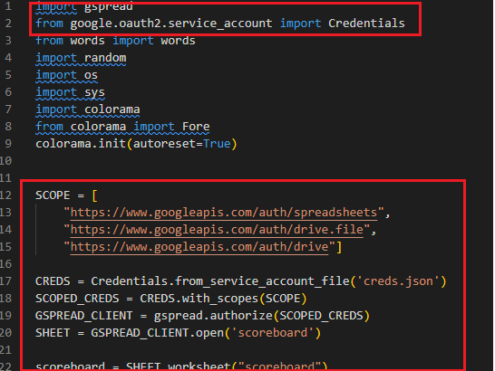

### Google Sheet Hangman Scoreboard

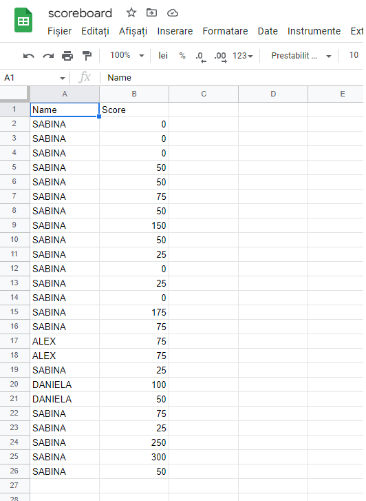

[Back to top](<#table-content>)

## Testing

### PEP 8 Online

The [PEP8](https://pep8ci.herokuapp.com/) Validator Service was used to validate every Python file in the project to ensure there were no syntax errors in the project.

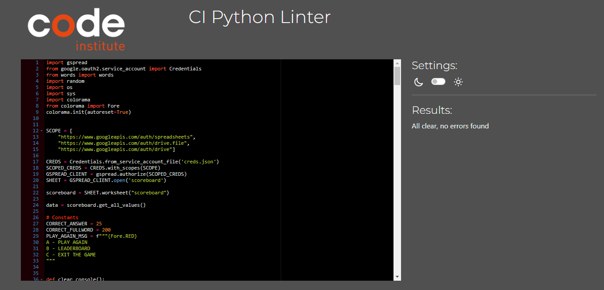.
* No errors or warnings were found during the testing of the code in PEP8v 

### Manual Testing  

1. 
- Expected - Show the logo and ask the user to enter their name.
- Testing - Run the program.
- Result - The program is working as expected, show the logo and ask the user to ask the name.

2. 
- Expected - The name input accept just letters.
- Testing - Insert letters, numbers and special characters.
- Result - When the letters were introduced the program takes as to the next step.
         - When the user input numbers or special characters the program show an error message and ask the user to enter a valid name.

3. 
- Expected - Show the rules and ask the user to press any key to start the game.
- Testing - Introduce the correct name and press enter. 
- Result - Show the rules of the game and ask the user to press any key to start the game.

4. 
- Expected - Start the game by pressing any key.
- Testing - Press any key to see if it's work.
- Result - After pressing any key the game is starting.
 
5. 
- Expected - Show the user a welcome message, number of letters in the word, hangman, wrong and correct letter guessed, score, lives and ask the user to input a letter.
- Testing - Press any key after reading the rules.
- Result - The game is starting and on the main display is shown a welcome message, number of letters in the word, wrong and correct letters, score, lives and user input.

6. 
- Expected - Show the correct letter and increment the score.
- Testing -  Add a letter.
- Result - The correct letter is added to letter space in the word and score is increment by 25 points.

7. 
- Expected - Show the incorrect letter and, take away a life and add a part to hangman graphic.
- Testing - Add a wrong letter.
- Result - The wrong letter is shown in red, the life is decrementing by one and the to hangman graphic is adding a part.

8. 
- Expected - The user is notified when insert a already guessed letter or an invalid entry like a special character or number.
- Testing - Add a guessed letter.
- Result - The user is notified with a message in red on the top of display.

9. 
- Expected - Guess the correct word take the user to the winner screen.
- Testing - Insert letter by letter or the full word.
- Result - If the user is guessing the word letter by letter on the screen will appear win message in red, score of the user and a message that the scoreboard is updated. On the bottom of this the menu is displayed. 
        - If the user is guessing the full word  on the screen will appear win message in green, score of the user and a message that the scoreboard is updated. On the bottom of this the menu is displayed. 
10. 
- Expected - Not guess the word take the user to a losing screen.
- Testing - Insert wrong letters.
- Result - On the screen is shown a loose message in red, score of the user and the menu at the bottom.

11. 
- Expected - Menu take the user to the option selected and if the user is typing an invalid option is notified.
- Testing - Insert a valid option, insert an invalid option.
- Result - Valid option insert take the user to the option choose.
         - Invalid option insert shown the user an error message and ask to user to insert a valid option.

12. 
- Expected - Insert first option (play again).
- Testing - Press a key.
- Result - Take the user to the main page of the game and the game is starting.

13. 
- Expected - Insert the second option (scoreboard).
- Testing - Press b key.
- Result - Take the user to the top 10 scores and at the bottom of the page is shown the menu.

14. 
- Expected - Insert the third option (exit game).
- Testing - Press c key.
- Result - Take the user to the closing page where a closing and a thank you message is displayed in red.

[Back to top](<#table-content>)

## Issues and Bugs

1. 
- Expected - Displays the top 10 best scores.
- Testing - Choose  the scoreboard option from the menu.
- Result - The scoreboard is not displayed and give an error.
- Fix - Create the display-score function where I connect the score-sheet from google sheets and give the condition length of update data less than 10 and if update data is equal with 10 to display update data.

2. 
- Expected - The username accept just letters.
- Testing - Insert numbers and special characters.
- Result - The username accept numbers and special characters.
- Fix - Set a conditional statement where if is username.isalpha and else is shown an error message and take the user to the name input.

3. 
- Expected - Clear terminal without any other text that is not accepted.
- Testing - Run the program.
- Result -  A NONE word is displayed on the logo and result screen.
- Fix - Exclude the intro function and rules function from print statement, just called the function without any print statement.
4. 
- Expected - PEP8 no warnings.
- Testing - Insert the code in the PEP8.
- Result - PEP8 is showing white and to many spaces errors and  line to long errors.
- Fix - Delete all the white spaces and rewrite the long lines.

[Back to top](<#table-content>)

## Deployment

1. On the main page click the button labelled New in the top right corner and from the drop-down menu select Create New App
2. Click on the Create App button
3. The next page is the project’s Deploy Tab. Click on the Settings Tab and scroll down to Config Vars
4. Click Reveal Config Vars and enter port into the Key box and 8000 into the Value box and click the Add button
5. Click Reveal Config Vars again and enter CREDS into the Key box and the Google credentials into the Value box
6. Next, scroll down to the Buildpack section click Add Buildpack select Python and click Save Changes
7. Then from the Buidpack add node.js.
8. Scroll to the top of the page and choose the Deploy tab
9. Select Github as the deployment method
10. Confirm you want to connect to GitHub
11. Search for the repository name and click the connect button
12. Scroll to the bottom of the deploy page and select the preferred deployment type.

### Local Development
To fork this repository, follow these steps:
- Log in to GitHub
- Go to the repository
- On the top right corner, click on the button that says fork.

To clone this repository, follow the steps:
- Log in to GitHub
- Go to the repository
- Beside the gitpod button, it is code button
- Press the Code button and the chose one of the two cloning methods
- 1. The first one is by copping the link 
- 2. The second one is by downloading(at the bottom) by pressing Download ZIP.

[Back to top](<#table-content>)

## Credits

### Content

* The idea on how to create a hangman game with Python were found on: 
- https://github.com/PedroCristo/portfolio_project_3#Logo-and-Intro-Message
- https://github.com/DanielMaherDev/Hangman
- [W3Schools - Python](https://www.w3schools.com/python/)
- [Stack Overflow](https://stackoverflow.com/)
- How to clear the console: https://appdividend.com/2022/06/03/how-to-clear-console-in-python/#:~:text=For%20the%20Windows%20system%2C%20to,('cls').
- Splitting up long strings: https://stackoverflow.com/questions/48881196/how-can-i-split-up-a-long-f-string-in-python
- Hangman ascii text:
- https://ascii.co.uk/art/hangman
- http://patorjk.com/software/taag/#p=testall&h=2&f=Blocks&t=You%20Lose

[Back to top](<#table-content>)

## Technologies Used
### Languages Used 

* [Python](https://www.python.org/)

#### Python Packages

* [Random](https://docs.python.org/3/library/random.html?highlight=random#module-random): returns a random integer to get a random word
* [Gspread](https://pypi.org/project/gspread/): allows communication with Google Sheets
* [Colorama](https://pypi.org/project/colorama/): allows terminal text to be printed in different colours / styles
* [google.oauth2.service_accoun](https://google-auth.readthedocs.io/en/stable/index.html): credentials used to validate credentials and grant access to Google service accounts
  
### Frameworks - Libraries - Programs Used

* [Git](https://git-scm.com/)
    * Git was used for version control by utilizing the Gitpod terminal to commit to Git and push to GitHub
* [GitHub](https://github.com/)
    * GitHub is used to store the project's code after being pushed from Git
* [Heroku](https://id.heroku.com)
    * Heroku was used to deploy the live project
* [Lucidchart](https://lucid.app/)
    * Lucidchart was used to create the flowchart
* [PEP8](https://pep8ci.herokuapp.com/)
    * The PEP8 was used to validate all the Python code

[Back to top](<#table-content>)

