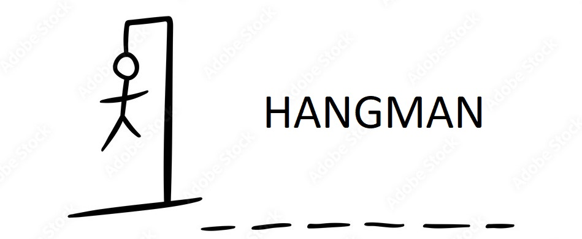
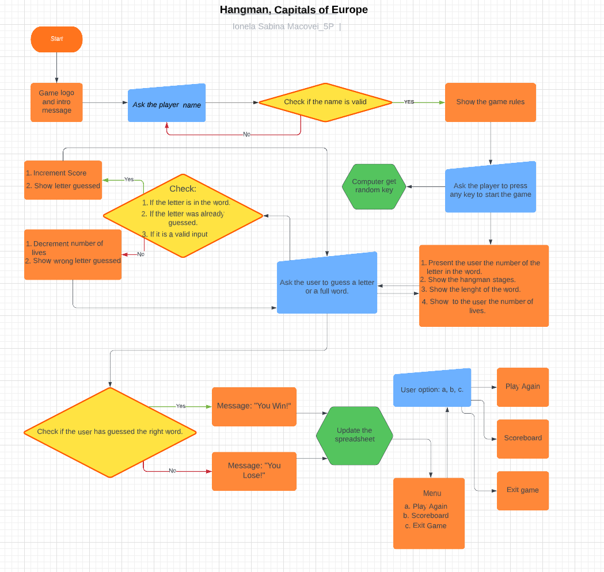

# Hangman, Capitals of Europe - Game

# Introduction
This project is based on the game HangMan, this game has been around since 1894 under the name "Birds, Beasts and Fishes".

 The main goal of the game is to guess the full word before hangman is hung. This is done by guessing a letter in the word.

If the guess is right, it is placed in the blank spaces that make up the word. If it is not, the user loses a life. The word must be guessed before the user runs out of lives.

[Live Project Here](https://hangman-project3.herokuapp.com/)

## Goal

My goal is to utilise my knowledge of python to create a game which gathers user inputs and provides responses based on the input given.

## Table Content

## User Experience - UX

* As a user, I want to:

1. Be able to understand the purpose of the App and start a new game.
2. Be able to follow the score, see the wrong and right letters appear once I take a turn, and see how many tries remain before the game is over.
3. Be able to watch my results and other players' results on the Scoreboard.
4. Be able to play the game again with a different word as chosen by the computer.
5. Be challenged and try to improve on my previous scores. 
6. Compare my scores with other users on the Scoreboard.

## Design

#### Colours
* The colours in the game are supplied by the Python Colorama Model

### Flowcharts
I designed this project on the basis of the below flowchart.I created flowcharts to assist me with the logical flow throughout the application. The charts were generated using [Lucidchart](https://lucid.app/) 

