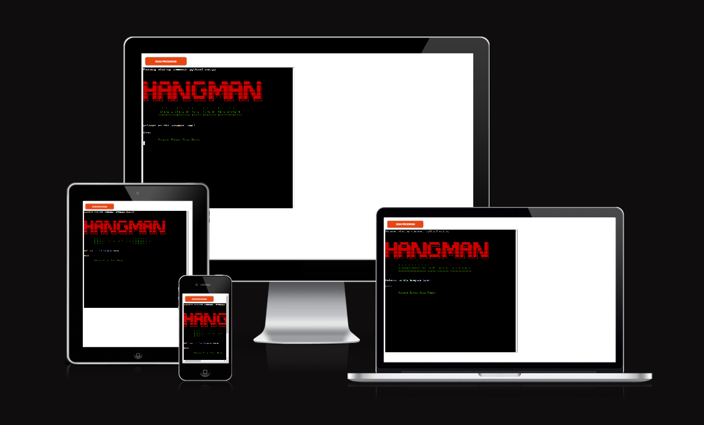

# Hangman, Capitals of Europe - Game

# Introduction
This project is based on the game HangMan, this game has been around since 1894 under the name "Birds, Beasts and Fishes".

 The main goal of the game is to guess the full word before hangman is hung. This is done by guessing a letter in the word.

If the guess is right, it is placed in the blank spaces that make up the word. If it is not, the user loses a life. The word must be guessed before the user runs out of lives.

[Live Project Here](https://hangman-project3.herokuapp.com/)

## Goal

My goal is to utilise my knowledge of python to create a game which gathers user inputs and provides responses based on the input given.

## Table Content

* [**Introduction**](<#introduction>)
* [**User Experience UX**](<#user-experience-ux>)
* [**Design**](<#design>)
    * [Colours](<#colours>)
    * [Flowcharts](<#flowcharts>)
* [**Game Features**](<#game-features>)
* [**Storage Data**](<#Storage-Data>)
* [**Testing**](<#testing>)
* [**Issues and Bugs**](<#issues-and-bugs>)
* [**Deployment**](<#deployment>)
* [**Credits**](<#credits>)
* [**Content**](<#content>)
* [**Technologies Used**](<#technologies-used>)

# User Experience UX

* As a user, I want to:

1. Be able to understand the purpose of the App and start a new game.
2. Be able to follow the score, see the wrong and right letters appear once I take a turn, and see how many tries remain before the game is over.
3. Be able to watch my results and other players' results on the Scoreboard.
4. Be able to play the game again with a different word as chosen by the computer.
5. Be challenged and try to improve on my previous scores. 
6. Compare my scores with other users on the Scoreboard.

[Back to top](<#table-content>)

## Design

#### Colours
* The colours in the game are supplied by the Python Colorama Model

### Flowcharts
I designed this project on the basis of the below flowchart.I created flowcharts to assist me with the logical flow throughout the application. The charts were generated using [Lucidchart](https://lucid.app/) 

[Back to top](<#table-content>)

## Game Features

### Logo and Intro Message

* When the users reach the website, they will see this feature. The game logo and the intro message are displayed here. 

### Game Rules

* After the user inputs their name, the program will display the game rules. The player then presses any key to start the game. 

### Hangman Stage 1
  

This feature displays where the main scene happens. Here the user can play and see the following information about the game:
* Numbers of letters chosen by the computer 
* Hangman stages
* Letters guessed right
* Letters guessed wrong
* Current score
* Current number of lives
* Input to guess a letter or a full word

  
  
Any time the player guesses a wrong letter, a part of the hangman appears

### Hangman Lose

* 7 letters guessed wrong the player will see the full hangman and the game is over.

### Hangman Win

* If the player guessed the full word letter by letter, they will see this feature and will win the game.

### Hangman Win Full Word

* If the player guessed all the letters that appear in the word thereby completing the word or at least guessing no more than 3 correct letters before completing the full word, this feature will appear.

### Menu Options

* In the end of the game users will have access to the menu where they can choose from these options:  
[A] - Play Again  
[B] - Leaderboard  
[C] - Exit Game

### Scoreboard

* The Scoreboard shows the 10 players with the best scores.

### Exit Game

* The players will see this message if they will chose to exit the game by typing [C].

[Back to top](<#table-content>)

## Storage Data

I have used a Google sheet to save the player name and score.  This sheet is connected to the code through the Google Drive and Google Sheet API by the Google Cloud Platform. This method allows me to send and receive data as I had access to the Google Sheet API credentials. I also added in the Config Vars to these credentials when I was deploying the project in Heroku. As this is sensitive data, I had to add the creds.json in the Git ignore file. This would ensure that these credentials are not pushed to the repository.

### Code to Connect to Google Sheet

### Google Sheet Hangman Scoreboard

[Back to top](<#table-content>)

## Testing

### PEP 8 Online

The [PEP8](https://pep8ci.herokuapp.com/) Validator Service was used to validate every Python file in the project to ensure there were no syntax errors in the project.

.
* No errors or warnings were found during the testing of the code in PEP8

### Lighthouse 

 Lighthouse was used to test Performance, Best Practices, Accessibility and SEO on the Desktop.

* Desktop Results:

  

### Manual Testing  
* The terminal has no issues and is working properly. 
* The input for name work properly and shows the user an alert if the input is empty.
* The game rules appear without any issues after the player submits their name.
* The option to press any key to start a game is running well. 
* At the end of the game, the Leaderboard is updating correctly.
* All the menu options are working without any fails.

[Back to top](<#table-content>)

## Issues and Bugs

1. 
- Expected - Displays the top 10 best scores.
- Testing - Chosse the scoreboard option from the menu.
- Result - The scoreboard is not diplayed and give an error.
- Fix - Create the display-score function where I connect the score-sheet from google sheets and give yhe condition length of update data less than 10 and if update data is equal with 10 to display update data.

[Back to top](<#table-content>)

## Deployment

1. On the main page click the button labelled New in the top right corner and from the drop-down menu select Create New App
2. Click on the Create App button
3. The next page is the project’s Deploy Tab. Click on the Settings Tab and scroll down to Config Vars
4. Click Reveal Config Vars and enter port into the Key box and 8000 into the Value box and click the Add button
5. Click Reveal Config Vars again and enter CREDS into the Key box and the Google credentials into the Value box
6. Next, scroll down to the Buildpack section click Add Buildpack select Python and click Save Changes
7. Then from the Buidpack add node.js.
8. Scroll to the top of the page and choose the Deploy tab
9. Select Github as the deployment method
10. Confirm you want to connect to GitHub
11. Search for the repository name and click the connect button
12. Scroll to the bottom of the deploy page and select the preferred deployment type.

### Local Development
To fork this repository, follow these steps:
- Log in to GitHub
- Go to the repository
- On the top right corner, click on the button that says fork.

To clone this repository, follow the steps:
- Log in to GitHub
- Go to the repository
- Beside the gitpod button, it is code button
- Press the Code button and the chose one of the two cloning methods
- 1. The first one is by copping the link 
- 2. The second one is by downloading(at the botom) by pressing Download ZIP.

[Back to top](<#table-content>)

## Credits

### Content

* The ideea on how to create a hangman game with Python were found on: 
- https://github.com/PedroCristo/portfolio_project_3#Logo-and-Intro-Message
- https://github.com/DanielMaherDev/Hangman
- [W3Schools - Python](https://www.w3schools.com/python/)
- [Stack Overflow](https://stackoverflow.com/)
- How to clear the console: https://appdividend.com/2022/06/03/how-to-clear-console-in-python/#:~:text=For%20the%20Windows%20system%2C%20to,('cls').
- Splitting up long strings: https://stackoverflow.com/questions/48881196/how-can-i-split-up-a-long-f-string-in-python
- Hangman ascii text:
- https://ascii.co.uk/art/hangman
- http://patorjk.com/software/taag/#p=testall&h=2&f=Blocks&t=You%20Lose

[Back to top](<#table-content>)

## Technologies Used
### Languages Used 

* [Python](https://www.python.org/)

#### Python Packages

* [Random](https://docs.python.org/3/library/random.html?highlight=random#module-random): returns a random integer to get a random word
* [Gspread](https://pypi.org/project/gspread/): allows communication with Google Sheets
* [Colorama](https://pypi.org/project/colorama/): allows terminal text to be printed in different colours / styles
* [google.oauth2.service_accoun](https://google-auth.readthedocs.io/en/stable/index.html): credentials used to validate credentials and grant access to Google service accounts
  
### Frameworks - Libraries - Programs Used

* [Git](https://git-scm.com/)
    * Git was used for version control by utilizing the Gitpod terminal to commit to Git and push to GitHub
* [GitHub](https://github.com/)
    * GitHub is used to store the project's code after being pushed from Git
* [Heroku](https://id.heroku.com)
    * Heroku was used to deploy the live project
* [Lucidchart](https://lucid.app/)
    * Lucidchart was used to create the flowchart
* [PEP8](https://pep8ci.herokuapp.com/)
    * The PEP8 was used to validate all the Python code

[Back to top](<#table-content>)

